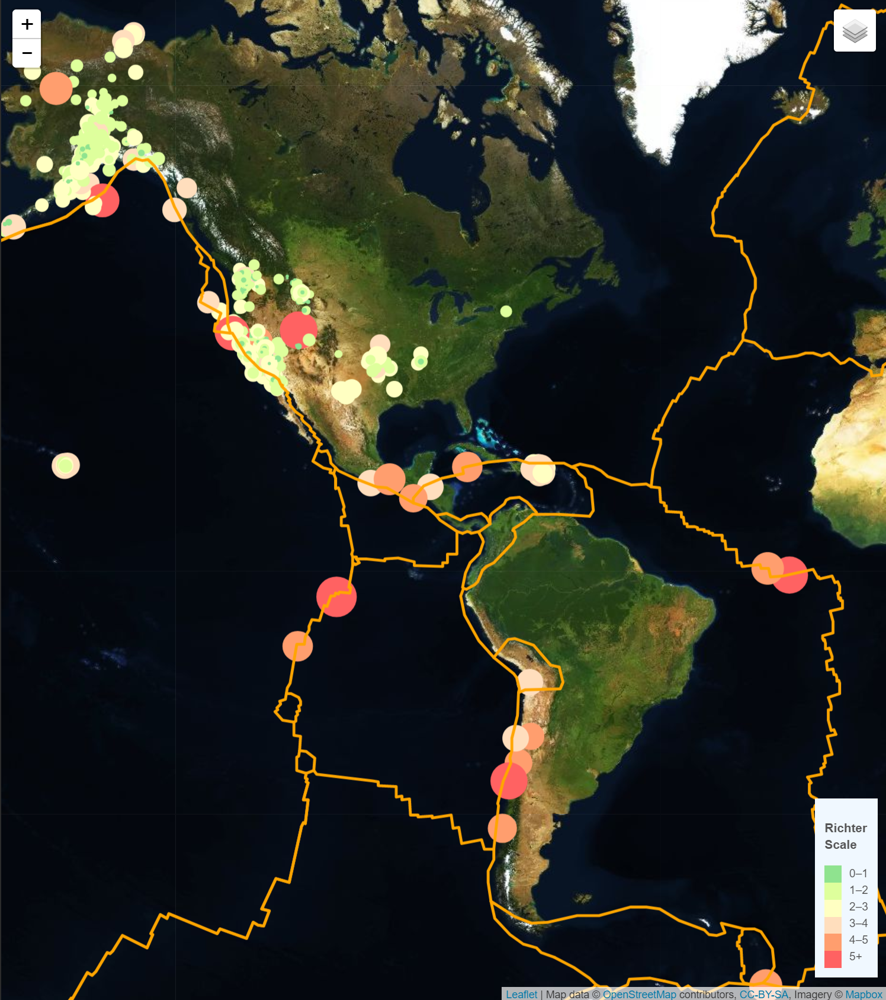
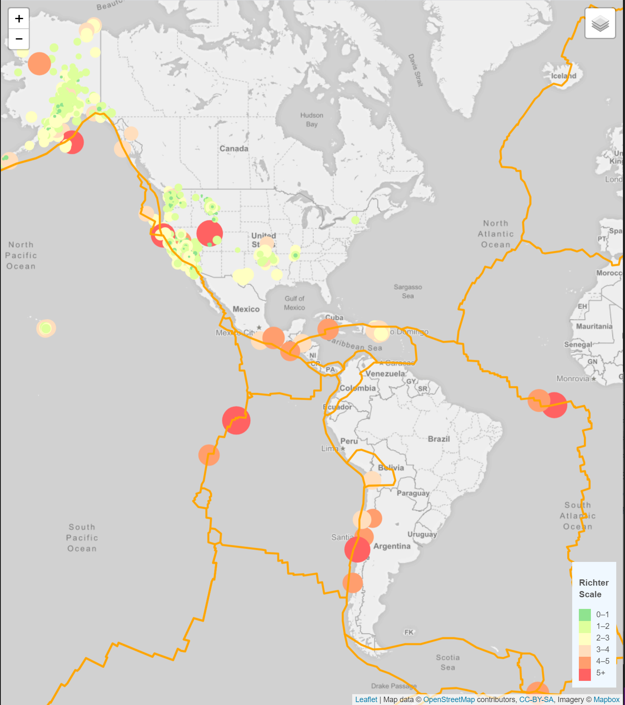
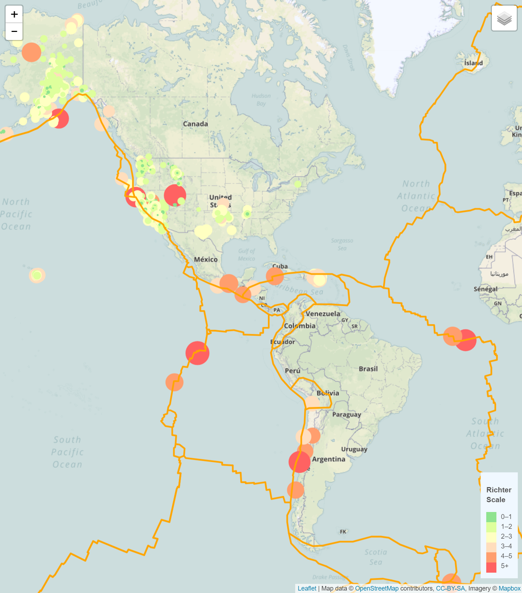

# VISUALIZING: Earthquake Data

## ABOUT

In this exercise, you can visualize earthquakes around the world. As well as tectonic plates*. 

 The United States Geological Survey (USGS) provides earthquake data in several different formats, updated every 5 minutes: [USGS GeoJSON Feed](http://earthquake.usgs.gov/earthquakes/feed/v1.0/geojson.php). For this exercise, the data correspond to the seismic activity registered in the last 7 days: [USGS GeoJSON 7 Days](https://earthquake.usgs.gov/earthquakes/feed/v1.0/summary/all_week.geojson)

 *Tectonic plates or lithospheric plates are the different fragments into which the Earth's lithosphere is divided, that is, the most superficial layer of the planet, where the crust and the upper part of the Earth's mantle are included. At its edges, seismic, volcanic and orogenic activity is concentrated.

Source: [Tectonic Plates](https://concepción.de/placas-tectonicas/#ixzz6HWiQn3Mu)

 
 
### Technology Used:
- HTML
- CSS
- Javascript

 

## INSTALL

* Clone from Github page
* In terminal or gitBash, run a git clone in desired file to save the repository.
* Run an npm install to download required packages.

## VISUALIZE

* Open Command Prompt
* Go to the directory where you saved the repository
* Press Enter
   --> You will need a HTTP server in Python, so:
 

* Type: py -m http.server
* Enter
* Go to the browser and in the address bar type: http://localhost:8000/
* Enter
 

## VISUALIZATIONS:

### * Satellite View: 

 

### * Gray Scale: 

 

### * Outdoors: 

